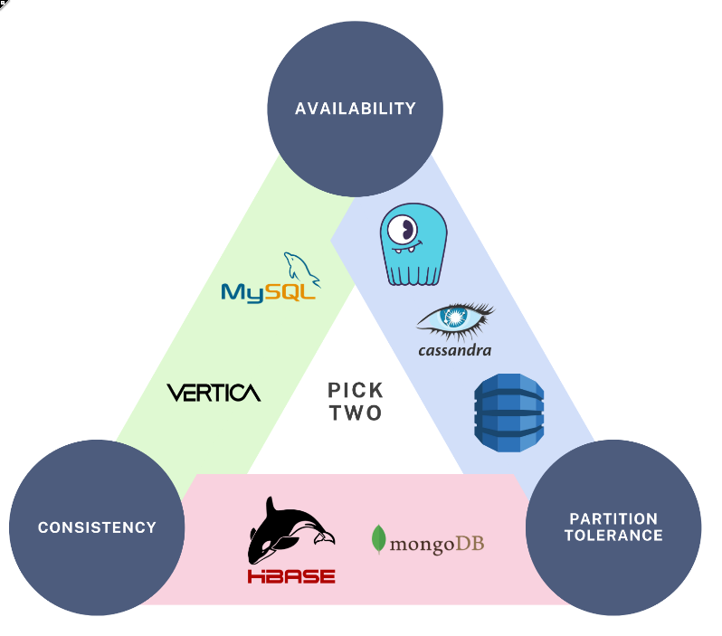
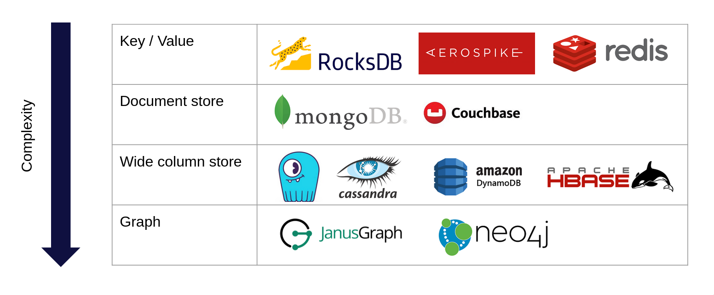

# NoSQL Para Iniciantes


## 1. Introdução ao NoSQL

NoSQL refere-se a "Not Only SQL" e descreve um conjunto de tecnologias de banco de dados que se afastam do modelo relacional tradicional, oferecendo flexibilidade em termos de estrutura de dados, escalabilidade e desempenho.

### 1.1 História e evolução dos bancos não-relacionais
- **Início:** Surgiram como resposta aos desafios impostos pelos sistemas relacionais tradicionais, principalmente com o advento da web e do Big Data.
- **Evolução:** Foram desenvolvidos para atender a demandas específicas, como alta disponibilidade, escalabilidade horizontal e modelagem de dados sem esquema fixo.
- **Contexto atual:** Hoje, NoSQL é amplamente utilizado em ambientes que requerem processamento de grandes volumes de dados em tempo real.

### 1.2 Diferenças entre SQL e NoSQL
- **SQL:**
  - Estrutura de dados baseada em tabelas e esquemas rígidos.
  - Suporte a transações ACID (Atomicidade, Consistência, Isolamento, Durabilidade).
- **NoSQL:**
  - Estrutura de dados flexível (documentos, grafos, colunas, chave-valor).
  - Foco em escalabilidade horizontal e performance em operações massivas de leitura/escrita.
  - Nem sempre garante consistência imediata, favorecendo a disponibilidade.

### 1.3 Conceitos fundamentais (CAP Theorem)



O teorema CAP postula que um sistema distribuído não pode simultaneamente garantir Consistência, Disponibilidade e Tolerância à Partição:
- **Consistência:** Todos os nós veem a mesma informação ao mesmo tempo.
- **Disponibilidade:** Cada requisição recebe uma resposta, sem garantia de que seja a última versão.
- **Tolerância à Partição:** O sistema continua operando mesmo na presença de falhas na comunicação entre nós.

// TODO: explicar em detalhes sobre o CAP Theorem com exemplos engraçados e cotidianos


## 2. Paradigmas NoSQL




### Key-Value Store
- **Estrutura simples de chave-valor:** Cada item é armazenado como um par, onde uma chave única é mapeada para um valor.
- **Casos de uso:** Armazenamento de sessões, caches, e aplicações que necessitam de acesso rápido a dados simples.
- **Estruturas de dados:** Trabalhe com strings, listas, conjuntos e hashes.
- **Operações básicas:** Implemente comandos simples para inserção, recuperação e manipulação de dados.
    ```
    127.0.0.1:6379> SET daniel "engracado-5-s" EX 5
    OK
    127.0.0.1:6379> GET daniel
    "engracado-5-s"
    127.0.0.1:6379> GET daniel
    (nil)
    127.0.0.1:6379> 
    ```


### Document Store
- **Documentos JSON/BSON:** Armazena dados em documentos, permitindo uma estrutura mais rica e aninhada.
- **Schemas flexíveis:** Não exige definição rígida de esquema, facilitando a evolução dos dados.
    ```json
    db={
        "orders": [
            {
                "_id": 1,
                "item": "almonds",
                "price": 12,
                "quantity": 2
            },
            {
                "_id": 2,
                "item": "pecans",
                "price": 20,
                "quantity": 1
            },
        ],
        "inventory": [
            {
                "_id": 1,
                "sku": "almonds",
                "description": "product 1",
                "instock": 120
            },
            {
                "_id": 2,
                "sku": "bread",
                "description": "product 2",
                "instock": 80
            },
            {
                "_id": 3,
                "sku": "cashews",
                "description": "product 3",
                "instock": 60
            },
            {
                "_id": 4,
                "sku": "pecans",
                "description": "product 4",
                "instock": 70
            }
        ]
    }
    ```

### Wide-Column Store
- **Famílias de colunas:** Armazena dados em linhas e colunas, mas com flexibilidade para definir diferentes famílias de colunas para diferentes tipos de dados.
- **Otimizado para grandes volumes:** Adequado para análise de grandes volumes de dados distribuídos.
- **Modelagem de dados:** Estruture dados em linhas e colunas, definindo famílias de colunas conforme a necessidade.
    ```sql
    -- CQL syntax
    CREATE KEYSPACE bluesky WITH REPLICATION = { 'class' : 'NetworkTopologyStrategy', 'replication_factor' : 1 };

    CREATE TABLE bluesky.user_posts (
        user_id uuid,
        post_id uuid,
        post_title text,
        post_content text,
        post_created_at timestamp,
        PRIMARY KEY (user_id, post_created_at, post_id)
    ) WITH CLUSTERING ORDER BY (post_created_at DESC, post_id ASC);
    ```

### Graph Database
- **Nodes e relacionamentos:** Estrutura os dados em nós (entidades) e arestas (relacionamentos), facilitando a modelagem de conexões complexas.
- **Queries em grafos:** Permite consultas sofisticadas para análise de redes e relacionamentos, como em redes sociais ou sistemas de recomendação.
    ```
    CREATE (daniel:User {name: "Daniel", age: 30})
    CREATE (joao:User {name: "João", age: 25})
    CREATE (daniel)-[:FOLLOWS]->(joao)
    ```

## 3. Quando Usar NoSQL?

A escolha entre bancos de dados NoSQL e relacionais é uma decisão crucial que impacta diretamente o sucesso do seu projeto. Antes de optar por uma solução NoSQL, é importante entender os cenários onde eles se destacam e os trade-offs envolvidos.

NoSQL não é uma solução universal - é uma ferramenta específica para casos de uso específicos. A decisão de usar NoSQL deve ser baseada em uma análise cuidadosa dos requisitos do seu sistema, considerando aspectos como:

### 3.1 Cenários ideais

- **Alta escalabilidade:** Ambientes que requerem escalabilidade horizontal para atender a grandes volumes de dados e tráfego.
- **Grandes volumes de dados:** Aplicações que necessitam de armazenar e processar grandes quantidades de informações.
- **Schemas flexíveis:** Sistemas em constante evolução onde os dados podem ter diferentes formatos.
- **Performance em escritas/leituras:** Aplicações que exigem operações rápidas de inserção e leitura de dados.

### 3.2 Trade-offs
- **Consistência vs Disponibilidade:** Muitas soluções NoSQL optam por alta disponibilidade, podendo comprometer a consistência imediata dos dados.
- **Transações ACID:** Nem todos os bancos NoSQL oferecem suporte completo a transações ACID, o que pode impactar a integridade dos dados em operações complexas.
- **Complexidade de queries:** Alguns bancos NoSQL podem ter limitações na execução de consultas complexas quando comparados a bancos relacionais.

### 3.3 Análise de requisitos
- **Como escolher o banco certo:** Avalie a natureza dos dados, o volume esperado, os requisitos de escalabilidade e as necessidades de consulta.
- **Fatores técnicos e de negócio:** Considere não só os aspectos técnicos, mas também os impactos no negócio, como custos de manutenção, facilidade de uso e a curva de aprendizado para a equipe.


